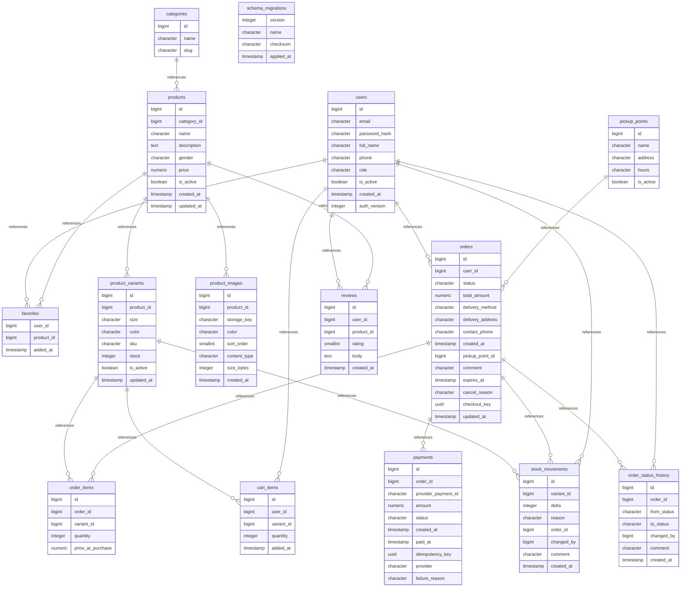

# Схема БД после миграции V003
Коммит 599a6b8129992d89e403aac0dda75371afee886c. Экспорт существующего QA-стенда 26.11.2026.

```mermaid
erDiagram
    cart_items {
        bigint id
        bigint user_id
        bigint variant_id
        integer quantity
        timestamp added_at
    }
    categories {
        bigint id
        character name
        character slug
    }
    favorites {
        bigint user_id
        bigint product_id
        timestamp added_at
    }
    order_items {
        bigint id
        bigint order_id
        bigint variant_id
        integer quantity
        numeric price_at_purchase
    }
    order_status_history {
        bigint id
        bigint order_id
        character from_status
        character to_status
        bigint changed_by
        character comment
        timestamp created_at
    }
    orders {
        bigint id
        bigint user_id
        character status
        numeric total_amount
        character delivery_method
        character delivery_address
        character contact_phone
        timestamp created_at
        bigint pickup_point_id
        character comment
        timestamp expires_at
        character cancel_reason
        uuid checkout_key
        timestamp updated_at
    }
    payments {
        bigint id
        bigint order_id
        character provider_payment_id
        numeric amount
        character status
        timestamp created_at
        timestamp paid_at
        uuid idempotency_key
        character provider
        character failure_reason
    }
    pickup_points {
        bigint id
        character name
        character address
        character hours
        boolean is_active
    }
    product_images {
        bigint id
        bigint product_id
        character storage_key
        character color
        smallint sort_order
        character content_type
        integer size_bytes
        timestamp created_at
    }
    product_variants {
        bigint id
        bigint product_id
        character size
        character color
        character sku
        integer stock
        boolean is_active
        timestamp updated_at
    }
    products {
        bigint id
        bigint category_id
        character name
        text description
        character gender
        numeric price
        boolean is_active
        timestamp created_at
        timestamp updated_at
    }
    reviews {
        bigint id
        bigint user_id
        bigint product_id
        smallint rating
        text body
        timestamp created_at
    }
    schema_migrations {
        integer version
        character name
        character checksum
        timestamp applied_at
    }
    stock_movements {
        bigint id
        bigint variant_id
        integer delta
        character reason
        bigint order_id
        bigint changed_by
        character comment
        timestamp created_at
    }
    users {
        bigint id
        character email
        character password_hash
        character full_name
        character phone
        character role
        boolean is_active
        timestamp created_at
        integer auth_version
    }
    users ||--o{ cart_items : references
    product_variants ||--o{ cart_items : references
    products ||--o{ favorites : references
    users ||--o{ favorites : references
    orders ||--o{ order_items : references
    product_variants ||--o{ order_items : references
    users ||--o{ order_status_history : references
    orders ||--o{ order_status_history : references
    pickup_points ||--o{ orders : references
    users ||--o{ orders : references
    orders ||--o{ payments : references
    products ||--o{ product_images : references
    products ||--o{ product_variants : references
    categories ||--o{ products : references
    products ||--o{ reviews : references
    users ||--o{ reviews : references
    users ||--o{ stock_movements : references
    orders ||--o{ stock_movements : references
    product_variants ||--o{ stock_movements : references
```